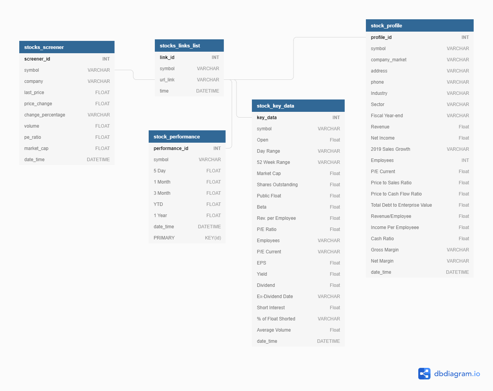

# Marketwatch Scraper

*this is a first version and this project is currently work-in-progress* 
---
This project is a financial data scraper, and it intended to generate data queries
from (www.marketwatch.com) \
our goal is to scrape stocks data and store it on a database.

---
### main.py

the stocks_screener function which scrapes the data from the stocks screener page \  
("https://www.marketwatch.com/tools/stockresearch/screener/") according to the following filter parameters:
* volume > 1M
* market capitalization > 100M
* exchange = 4 options available: [all,NYSE, NASDAQ, AMEX] , default = 'all'
* industry = all

The stocks_screener function generates two tables data uploaded to the "market_scraper" database:
1. stocks_screener - list of the top 50 "top gainers" stocks during the last 24 hours time period.
2. stocks_links_list - a table containing the url links for each one the stocks gathered.

After generating the above tables, the program calls the "sp.stock_key_data()" and the \
    "sp.stock_profile()" functions from the stock_performance.py file (details below) to \
    complete the stocks data scraping.

*check the complete DataBase documentation below.

---
### stock_performance.py
This is a helper program to the main.py program,\
it contains most of the project functions.
The main purpose of this program is to scrape additional data for each stock found in the stocks_links_list table.

program functions:
1. url_check(url) - receive a url address, connecting and checking the request status to url address.
2. df_to_db(database_name, table_name, df, option='append' ) - uploads pandas DataFrame to the Database
3. db_to_df(database_name, table_name) - loading pandas DataFrame from the Database
4. value_to_float(value_string) - This function converts a string value containing ('$','K','M','B') to a float number:
     'K' = value *1000
     'M' = value *1,000,000
     'B' = value *1,000,000,000
5. stock_key_data() - scrapes the stock 'KEY DATA' and the 'PERFORMANCE' tables from the stock 'OVERVIEW' page
6. stock_profile() - scrapes the stock 'Profile' data from the Profile url page
7. stock_performance(soup,symbol) - scrapes the stock 'PERFORMANCE' table from the stock 'OVERVIEW' page
8. get_stock_financials() - scrapes the stock financials data -> currently not in use (future option)

*check the complete DataBase documentation below.

#### Installations
from bs4 import BeautifulSoup
import requests
import logging
import pandas as pd
from sqlalchemy import create_engine
import re
import stock_performance as sp
import create_db
from sqlalchemy import create_engine, MetaData, Table, Column, Integer, String,Float,DateTime
import os.path
---------------------------------------------------------------------------------------------

### -- DataBase documentation --

stocks_screener table columns:
	screener_id INT [pk, increment]
	symbol VARCHAR
	company VARCHAR
	last_price FLOAT
	price_change FLOAT
	change_percentage VARCHAR
	volume FLOAT
	pe_ratio FLOAT
	market_cap FLOAT
	date_time DATETIME

stocks_links_list table columns:
    link_id INT [pk, increment]
    symbol VARCHAR
    url_link VARCHAR
    time DATETIME

stock_key_data table columns:
	key_data INT [pk, increment]
	symbol VARCHAR
	"Open" Float
	"Day Range" VARCHAR
	"52 Week Range" VARCHAR
	"Market Cap" Float
	"Shares Outstanding" Float
	"Public Float" Float
	"Beta" Float
	"Rev. per Employee" Float
	"P/E Ratio" Float
	"Employees" VARCHAR
	"P/E Current" VARCHAR
	"EPS" Float
	"Yield" Float
	"Dividend" Float
	"Ex-Dividend Date" VARCHAR
	"Short Interest" Float
	"% of Float Shorted" VARCHAR
	"Average Volume" Float
	date_time DATETIME

stock_profile table columns:
	profile_id INT [pk, increment]
	symbol VARCHAR
	company_market VARCHAR
	address VARCHAR
	phone VARCHAR
	"Industry" VARCHAR
	"Sector" VARCHAR
	"Fiscal Year-end" VARCHAR
	"Revenue" Float
	"Net Income" Float
	"2019 Sales Growth" VARCHAR
	"Employees" INT
	"P/E Current" Float
	"Price to Sales Ratio" Float
	"Price to Cash Flow Ratio" Float
	"Total Debt to Enterprise Value" Float
	"Revenue/Employee" Float
	"Income Per Employeee" Float
	"Cash Ratio" Float
	"Gross Margin" VARCHAR
	"Net Margin" VARCHAR
	date_time DATETIME

## Datebase ERD diagram:

#### command line scraper setup
add commands \
add arguments 

#### for more information and support:
please contact by email [ohadohad5@gmail.com](ohadohad5@gmail.com) and [chupavik@gmail.com](chupavik@gmail.com)

